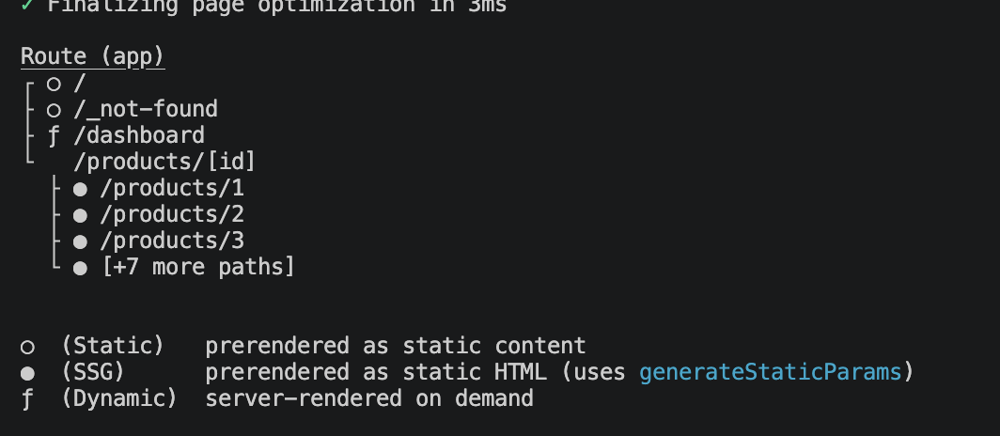

# Next.js 15 패러다임 변화

- **이전 버전 (Next.js 14):** `fetch` 요청 시 기본적으로 데이터를 **자동 캐싱**하여 개발자들을 혼란스럽게 함.
- **Next.js 15+ 표준:** 기본 정책이 완전히 뒤집혀, **기본적으로 캐싱을 하지 않고** 매 요청마다 최신 데이터를 가져옴 (`no-store` 기본 적용).

- 캐시 옵션
  | 캐시 옵션 (`RequestCache`) | 핵심 동작 방식 | 캐시 저장 여부 | 주요 특징 및 활용 상황 |
  | --------------------------------------- | --------------------------------------------------- | ------------------- | --------------------------------------------------------- |
  | **`"no-store"`** _(Next.js 15+ 기본값)_ | 캐시를 전혀 조회하지 않고 매번 새로 가져옴 | ❌ 저장 안 함 | 실시간성이 중요한 데이터 (주식, 날씨, 장바구니 등) |
  | **`"force-cache"`** | 무조건 캐시를 우선 조회하고, 없으면 새로 저장함 | ⭕ 영구 저장 | 빌드 시점에 고정해도 되는 정적 데이터 (회사 소개, 블로그) |
  | **`"default"`** | 환경(브라우저, 프레임워크)의 기본 캐시 정책을 따름 | 환경에 따라 다름 | 표준적인 웹 브라우저 캐시 규칙을 따를 때 사용 |
  | **`"no-cache"`** | 캐시를 쓰기 전 서버에 "변경 여부"를 먼저 검사함 | ⭕ 조건부 갱신 | 데이터가 최신인지 검증하면서 기존 캐시를 재활용할 때 |
  | **`"reload"`** | 기존 캐시를 완전히 무시하고 새로 가져와서 덮어씌움 | ⭕ 새로 덮어쓰기 | 브라우저의 '강력 새로고침'과 동일한 동작 |
  | **`"only-if-cached"`** | 캐시에 데이터가 없으면 네트워크 요청 없이 에러 발생 | ⭕ (기존 캐시 활용) | 오프라인 환경이나 캐시가 반드시 존재해야 하는 특수 상황 |

## 1. 핵심 렌더링 전략 비교

| 구분            | 동적 렌더링 (Dynamic)                        | 정적 렌더링 (Static)                       |
| --------------- | -------------------------------------------- | ------------------------------------------ |
| **코드 설정**   | 기본값 (또는 명시적 `{ cache: 'no-store' }`) | `{ cache: 'force-cache' }`                 |
| **작동 시점**   | 사용자가 접속할 때마다 (**Runtime**)         | 프로젝트 빌드 시 단 한 번 (**Build time**) |
| **데이터 상태** | 항상 최신 데이터 유지                        | 빌드 시점의 데이터로 영구 고정             |
| **체감 속도**   | 보통 (외부 API/DB 응답 속도 의존)            | **매우 빠름** (CDN을 통해 즉각 전송)       |
| **추천 용도**   | 주식 시세, 날씨, 장바구니, 실시간 피드 등    | 회사 소개, 이용 약관, 블로그 포스트 등     |

## 2. 실무 테스트 가이드 (`npm run dev` 주의점)

개발 모드(`npm run dev`)에서는 프레임워크가 편의상 캐시를 자주 무시하므로, 캐싱이 정상 작동하는지 확인하려면 **반드시 프로덕션 모드**로 테스트해야 합니다.

1. **빌드 실행:** `npm run build`
2. **빌드 로그 확인:** 경로 옆 기호 확인

- `○` (Static): 정적 렌더링 적용됨
- `ƒ` (Dynamic): 동적 렌더링 적용됨

3. **서버 구동:** `npm run start` 로 프로덕션 서버 실행 후 새로고침하며 시간 변화 확인

**참고**
개발 모드(`npm run dev`)는 실시간 코드 반영과 개발 편의성(DX)에 최적화되어 있기 때문에, 운영 환경처럼 엄격한 캐싱이 작동하지 않습니다.

- **실시간 변경 사항 반영 (Hot Reloading):** 개발 중에는 코드를 고치거나 데이터를 수정했을 때 브라우저에 즉시 반영되어야 합니다. 만약 캐싱이 엄격하게 작동하면, 코드를 바꿔도 캐시된 옛날 데이터나 화면이 계속 보여서 디버깅이 불가능해집니다.
- **온디맨드(On-Demand) 컴파일 방식:** 개발 모드는 미리 페이지를 빌드(`build`)해두는 것이 아니라, 사용자가 접속할 때 페이지를 실시간으로 컴파일합니다. 이 과정에서 캐시보다 빠른 코드 반영과 디버깅 편의가 우선시됩니다.
- **프레임워크의 의도적인 캐시 무력화:** Next.js를 비롯한 모던 프레임워크들은 개발 환경에서 개발자가 "왜 내가 코드를 바꿨는데 데이터가 안 바뀌지?"라며 혼란을 겪지 않도록 캐시 저장소의 동작을 강제로 완화하거나 무시하도록 설계되어 있습니다.

개발 모드는 **코드를 빠르게 고치고 테스트하는 공간**이고, 프로덕션 모드(`npm run build` & `npm run start`)는 **최적화된 성능으로 사용자에게 서비스하는 실제 환경**이기 때문에 캐시의 동작 방식이 다릅니다.

# ISR

## 1. 주요 용어 정리

- **리밸리데이션 (Revalidation):** 캐시에 저장된 데이터의 유효기간이 지났을 때, 서버가 데이터를 다시 검증하고 최신 상태로 갱신하는 과정.
- **ISR (Incremental Static Regeneration):** 전체 사이트를 재빌드하지 않고, 유효기간이 지난 특정 페이지만 백그라운드에서 새 HTML로 구워 갈아 끼우는 기술.

## 2. 구현 방법 (두 가지 방식)

- **Fetch 옵션 사용 (개별 데이터 제어):**

```typescript
const res = await fetch("...", {
  next: { revalidate: 3 }, // 3초 주기로 재검증 (단위: 초)
});
```

- **라우트 세그먼트 설정 (페이지 전체 제어):** ORM이나 Axios 등 `fetch`를 쓰지 않을 때 파일 최상단에 선언

```typescript
export const revalidate = 60; // 60초마다 페이지 전체 재검증
```

## 3. 작동 원리: SWR 패턴 (Stale-While-Revalidate)

1. **최초 접속 (0초):** 서버가 데이터를 가져와 캐시에 저장 (사용자는 약간의 로딩 발생).
2. **유효 기간 내 (0~3초):** 1만 명이 접속해도 캐시된 정적 데이터를 0.01초 만에 즉시 반환.
3. **만료 직후 (3초 이후):**

- 접속한 사용자에게는 우선 기존의 **상한(Stale) 데이터**를 즉시 보여줌 (지연 시간 제로).
- 백그라운드 몰래 새 데이터를 가져와 캐시를 갱신함.

4. **다음 접속자:** 갱신된 최신 데이터를 보게 됨.

## 4. 렌더링 3대장 전략 비교

| 전략                         | 핵심 특징                                          | 주요 코드 설정                                                | 실무 활용 사례                       |
| ---------------------------- | -------------------------------------------------- | ------------------------------------------------------------- | ------------------------------------ |
| **⚡ Dynamic** (동적 렌더링) | 접속할 때마다 실시간으로 새로 만듦                 | 기본값 또는 `cache: 'no-store'`                               | 주식/코인 시세, 검색 결과, 장바구니  |
| **🧊 Static** (정적 렌더링)  | 빌드할 때 단 한 번만 만들고 영구 고정              | `cache: 'force-cache'`                                        | 회사 소개, 이용 약관, 블로그 포스트  |
| **♻️ ISR** (점진적 재생성)   | 평소엔 정적처럼 빠르고, 주기적으로 백그라운드 갱신 | `next: { revalidate: 3 }` 또는 `export const revalidate = 60` | 쇼핑몰 상품 목록, 뉴스 메인 홈페이지 |

# generateStaticParams

## 1. `generateStaticParams` 개념

- **정의:** 동적 라우팅 경로(`[id]`)를 가진 페이지들을 빌드 시점에 미리 정적 HTML(SSG)로 구워내기 위해 **ID 명단을 Next.js에 전달하는 함수**.
- **비유:** 대규모 행사 전 인쇄소에 미리 VIP 명단을 주어 네임택을 전부 인쇄해 두는 것과 동일.

## 2. 구현 핵심 포인트 (Next.js 15+)

- **명단 반환 형식:** 반드시 `[{ id: '1' }, { id: '2' }, ...]` 형태의 **문자열(String) 배열**로 리턴.
- **비동기 `params` 해제:** Next.js 15부터는 컴포넌트 내부에서 `params`를 사용할 때 반드시 `await`로 언랩(`const { id } = await params;`)해야 함.

## 3. 빌드 로그 기호 (Build Symbols)

- **`○` (Static):** 데이터 패칭 없는 순수 정적 페이지
- **`ƒ` (Dynamic):** 요청 시 실시간 렌더링하는 동적 페이지
- **`●` (SSG):** 데이터 패칭까지 완료하여 완벽하게 정적으로 구워진 페이지 (`generateStaticParams` 적용)

## 4. `dynamicParams` 옵션 (명단 외 ID 접근 처리)

| 설정값                | 동작 방식           | 설명                                                        |
| --------------------- | ------------------- | ----------------------------------------------------------- |
| **`true`** _(기본값)_ | 실시간 생성 및 캐싱 | 명단에 없는 ID 접근 시 서버가 즉시 동적 렌더링 후 캐시 저장 |
| **`false`**           | 404 차단            | 명단에 없는 ID 접근 시 무조건 404 Not Found 에러 반환       |

## 실습

### 1. 정적 빌드 상세 페이지 코드 (`src/app/products/[id]/page.tsx`)

```typescript
import React from 'react';

// [옵션 설정]
// true(기본값): 미리 빌드 안 된 ID로 접속 시 실시간 생성 (Dynamic)
// false: 미리 빌드 안 된 ID로 접속 시 즉시 404 페이지 반환
export const dynamicParams = true;

/**
 * 1. 정적 파라미터 생성 함수
 * 빌드 타임에 실행되어 "이 ID들로 페이지를 미리 만들어줘"라고 명령합니다.
 */
export async function generateStaticParams() {
  // 실무에서는 DB에서 인기가 많은 상위 10개 상품의 ID 목록만 가져옵니다.
  const res = await fetch('https://jsonplaceholder.typicode.com/posts');
  const posts = await res.json();

  // 반드시 [{ id: '1' }, { id: '2' }, ...] 형태의 문자열 배열을 반환해야 합니다.
  return posts.slice(0, 10).map((post: { id: number }) => ({
    id: String(post.id),
  }));
}

/**
 * 2. 상세 페이지 컴포넌트
 * 빌드 타임에는 위 함수에서 받은 ID들로 10번 실행되어 HTML이 생성됩니다.
 * 배포 후에는 사용자 요청에 따라 동작합니다.
 */
type Props = {
  params: Promise<{ id: string }>;
};

export default async function ProductDetail({ params }: Props) {
  // Next.js 15 비동기 파람스 처리
  const { id } = await params;

  // 데이터 페칭 (이미 빌드된 페이지라면 이 fetch는 빌드 타임에 완료되어 HTML에 박제됩니다.)
  const res = await fetch(`https://jsonplaceholder.typicode.com/posts/${id}`);

  if (!res.ok) return <div className="p-10">상품 정보를 불러올 수 없습니다.</div>;

  const product = await res.json();

  return (
    <div className="min-h-screen bg-white p-12">
      <div className="max-w-3xl mx-auto border-l-8 border-slate-900 pl-10">
        <span className="text-xs font-black bg-slate-900 text-white px-3 py-1 uppercase tracking-tighter">
          Exclusive Content
        </span>
        <h1 className="text-5xl font-black mt-6 mb-4 text-slate-900 leading-tight italic">
          {product.title}
        </h1>
        <p className="text-xl text-slate-500 font-medium leading-relaxed">
          {product.body}
        </p>
        <div className="mt-12 text-[10px] font-mono text-slate-300 uppercase tracking-widest">
          Product ID: {id} | Generated via Static Params
        </div>
      </div>
    </div>
  );
}

```

### 2. 코드 핵심 요약

- **`generateStaticParams`**: 인쇄소에 넘길 "손님 명단"입니다. 빌드 타임에 이 함수가 반환하는 10개의 ID만큼 HTML 파일이 미리 생성됩니다.
- **`dynamicParams`**: 뷔페에 없는 메뉴를 주문했을 때 주방장이 즉석요리를 해줄지(`true`), 아니면 안 판다고 할지(`false`) 결정하는 스위치입니다.
- **성능적 이점**: `id: 1`부터 `10`까지는 서버가 연산을 하지 않습니다. 이미 완성된 파일을 HDD에서 꺼내주기만 하므로 응답 속도가 0.01초대에 수렴합니다.

## 3. Next.js 15 정적 최적화 엔진 분석

### ① `generateStaticParams`: 빌드 타임의 정적 페이지 오케스트레이터

- **엔지니어링 본질**: SSG(Static Site Generation)를 구현하기 위한 핵심 제어권입니다. Next.js 빌드 엔진은 `next build` 과정에서 이 함수를 가장 먼저 호출하여, 동적 라우트(`[id]`)에 주입할 파라미터 배열을 확보합니다.
- **기술적 메커니즘**:
- 이 함수가 반환하는 배열의 길이만큼 서버는 `fetch`를 미리 수행하고, 그 결과물을 물리적인 `.html` 파일과 `.json`(RSC Payload) 파일로 디스크에 생성(Pre-rendering)합니다.
- 반환되는 객체의 `id` 값은 반드시 문자열(String)이어야 하는데, 이는 URL 경로가 시리얼라이즈(Serialize)된 텍스트 데이터이기 때문입니다.

- **실무 팁**: 모든 데이터를 여기서 다 구우면 빌드 시간이 무한정 늘어날 수 있습니다. 따라서 '조회수 상위 100개' 혹은 '최근 일주일 신상품' 등 비즈니스 중요도가 높은 데이터만 선별적으로 정적 빌드하는 것이 아키텍처 설계의 정수입니다.

### ② `dynamicParams`: 온디맨드(On-demand) 렌더링 폴백 전략

- **엔지니어링 본질**: 미리 정의되지 않은 세그먼트에 대한 서버의 대응 로직을 결정하는 정책 스위치입니다.
- **기술적 메커니즘**:
- **`true` (기본값)**: 명단에 없는 ID로 접속 시, Next.js는 즉시 404를 띄우지 않고 서버에서 실시간으로 렌더링(SSR)을 시도합니다. 생성된 페이지는 즉시 캐시되어, 다음 접속자부터는 정적 페이지(Static)처럼 동작하게 됩니다 (ISR의 특성을 가짐).
- **`false`**: 일종의 'Strict Mode'입니다. `generateStaticParams`에서 선언되지 않은 모든 경로는 런타임 연산을 시도조차 하지 않고 즉시 `notFound()` 처리를 합니다.

- **실무 팁**: 상품 수가 고정된 관리자 페이지나 한정판 이벤트 페이지처럼 보안과 리소스 통제가 엄격해야 하는 곳에서는 `false`를, 일반적인 커머스 상세 페이지에서는 사용자 경험을 위해 `true`를 권장합니다.

### ③ 성능적 이점: 컴퓨팅(Compute)에서 스토리지(I/O)로의 패러다임 전환

- **엔지니어링 본질**: 사용자 요청 시점에 발생하던 $O(n)$의 복잡도를 빌드 시점으로 전이시켜, 런타임의 TTFB(Time to First Byte)를 극한으로 낮추는 기술입니다.
- **기술적 메커니즘**:
- **일반적인 동적 페이지**: `Request -> Server Logic -> DB Query -> API Call -> HTML Render -> Response`의 복잡한 과정을 거칩니다.
- **정적 최적화가 적용된 페이지**: 서버가 이미 완성된 파일을 들고 있어 `Request -> File I/O -> Response`로 과정을 단순화합니다.

- **수치적 결과**: 데이터베이스 쿼리 레이턴시(Latency)와 외부 API 오버헤드가 완전히 제거되므로, 네트워크 환경이 받쳐준다면 응답 속도는 **0.01초대**에 수렴하며 CDN(Content Delivery Network) Edge 캐싱을 100% 활용할 수 있는 구조가 됩니다.

## generateStaticParams 함수는 빌드타임에 무슨일이 일어날까?

- 사용자가 웹사이트에 접속할 때 서버가 API를 호출하는 것이 아니라, **개발자가 배포하기 위해 빌드하는 시점(`npm run build`)에 단 한 번만 실행된다**는 뜻입니다.

- **일반적인 동적 페이지 (SSR):** 사용자가 `/products/1`에 들어올 때마다 서버가 그때서야 `fetch`를 실행해 외부 API를 찌르고 기다립니다.
- **정적 빌드 페이지 (SSG + `generateStaticParams`):**

1. 개발자가 `npm run build`를 치는 순간, Next.js가 `generateStaticParams`가 준 명단(`1`~`10`)을 가지고 이 컴포넌트를 미리 10번 실행합니다.
2. 그때 코드 안의 `fetch('.../1')`가 돌아서 가져온 데이터(`title`, `body` 등)를 **HTML 파일 안에 아예 글자 그대로 박아 넣어(박제)** 버립니다.
3. 나중에 실제 사용자가 웹사이트에 들어오면, 서버는 외부 API를 다시 찌를 필요 없이 **이미 박제되어 있는 HTML 파일을 0.01초 만에 그대로 꺼내서** 보여줍니다.

즉, "런타임(사용자 접속 시점)에는 API 통신이 발생하지 않고, 이미 빌드 때 만들어둔 정적 결과물을 그대로 사용한다"는 의미입니다.



## 개발모드에서는 generateStaticParams 함수를 사용하지 않은건가?

개발 모드(`npm run dev`)에서도 **`generateStaticParams`는 실행됩니다.** 하지만 정적 파일로 미리 구워두는 방식(SSG)이 아니라 **동적으로 작동 방식이 바뀝니다.**

개발 모드에서 `generateStaticParams`와 정적 빌드가 다르게 동작하는 이유는 다음과 같습니다.

- **빌드 타임이 없음 (On-Demand 실행):** 개발 모드에는 '빌드 시점(`npm run build`)'이라는 개념이 없습니다. 대신 사용자가 브라우저로 해당 페이지에 접속하는 순간(Runtime)에 코드를 컴파일하고 실행합니다.
- **명단의 역할 변화:**
- 프로덕션 모드에서는 `generateStaticParams`가 반환한 ID들만 미리 HTML로 구워둡니다.
- 개발 모드에서는 이 명단이 **"미리 구워두는 용도"가 아니라, 나중에 동적으로 페이지를 생성할 때 참조하는 라우트 제어용**으로 주로 쓰이거나, 개발 편의를 위해 매 요청마다 유연하게 처리됩니다.

- **캐시 무력화:** 앞서 살펴본 것처럼 개발 모드에서는 캐싱과 정적 최적화 메커니즘이 대부분 해제되어 있기 때문에, `generateStaticParams`로 지정한 페이지든 아니든 접속할 때마다 서버가 실시간으로 코드를 다시 읽어와 처리합니다.

즉, `generateStaticParams` 코드가 실행은 되지만, 프로덕션 환경처럼 "미리 파일을 왕창 만들어두는 정적 빌드(SSG)의 마법"은 오직 `npm run build`를 실행했을 때만 온전히 발휘됩니다.

## generateMetadata

### 1. 메타데이터(Metadata) 개요

- **정의**: '데이터에 관한 데이터'로, 검색 엔진 크롤러나 소셜 미디어 봇이 웹사이트를 이해하고 평가할 수 있도록 `<head>` 태그 안에 숨겨져 제공되는 요약 정보입니다.
- **비유**: 책 본문이 실제 '데이터'라면, 책 표지의 제목·저자·줄거리는 '메타데이터'입니다.

### 2. Next.js 15 동적 메타데이터 (`generateMetadata`)

- **필요성**: 상품 상세 페이지처럼 URL의 `[id]`에 따라 제목과 설명이 동적으로 바뀔 때 사용하는 Next.js의 약속된 비동기 함수입니다.
- **핵심 구현 코드 구조**:

```typescript
type Props = {
  params: Promise<{ id: string }>;
};

export async function generateMetadata({ params }: Props): Promise<Metadata> {
  const { id } = await params; // Next.js 15 규격: params 비동기 해제
  const res = await fetch(`https://jsonplaceholder.typicode.com/posts/${id}`);
  const product = await res.json();

  return {
    title: `${product.title} | My Amazing Shop`,
    description: product.body.slice(0, 100),
    openGraph: {
      title: `${product.title} 특가 판매 중!`,
      description:
        "지금 바로 우리 쇼핑몰에서 한정 수량 특가 상품을 확인하세요!",
      images: [`/api/og?title=${product.title}`],
      type: "website",
    },
  };
}
```

### 3. 성능 최적화: 요청 중복 제거 (Request Memoization)

- **의문**: `generateMetadata`와 `ProductDetail` 컴포넌트에서 각각 `fetch`를 두 번 호출하면 서버 부하가 생기지 않을까?
- **정답**: **전혀 문제없음.** Next.js 코어의 **요청 중복 제거** 기능 덕분에, 동일한 렌더링 사이클 안에서 같은 `fetch` 요청이 발생하면 첫 번째 결과를 메모리에 캐싱한 후 두 번째부터는 즉시 재사용하므로 성능 저하가 없습니다.

### 4. Open Graph (OG) 마케팅 효과

- **정의**: 페이스북이 만든 국제 표준 규격으로, 카카오톡·슬랙 등에 링크 공유 시 예쁜 썸네일 카드(이미지, 제목, 요약) 형태로 보이게 만듭니다.
- **가치**: 단순 텍스트 링크보다 시선을 사로잡아 클릭률(CTR)과 유입량을 극대화하는 가성비 최고의 마케팅 요소입니다.

### 5. 검증 및 테스트 방법

- **브라우저 탭**: 상세 페이지(`/products/1`) 접속 시 상단 탭 제목 확인.
- **소스 코드**: 우클릭 후 `페이지 소스 보기(Ctrl + U)`를 통해 `<head>` 안의 `<title>`, `<meta name="description">`, `<meta property="og:...">` 태그 검증.
- **소셜 미리보기**: 로컬(`localhost`) 환경은 카카오톡 봇이 접근하지 못하므로, `ngrok` 등을 사용하거나 실제 배포 후 테스트.

## 실습

## 서버 컴퍼너트인데도 왜 네크워크 요청에 보이는거지?

- 브라우저 개발자 도구의 Network(네트워크) 탭을 확인하셨을 때, 외부 API 주소(`jsonplaceholder.typicode.com`)가 직접 찍히는 것은 아니어야 정상입니다.

- Next.js 서버 컴포넌트에서 실행되는 `fetch`는 사용자의 브라우저가 아니라 Next.js 서버(Node.js)가 백그라운드에서 직접 외부 API로 요청을 보내는 방식이기 때문입니다.

- 브라우저의 네트워크 탭에 보이는 요청은 외부 API로 향하는 요청이 아니라, 내 브라우저가 내 Next.js 서버로 페이지를 달라고 요청하는 주소(`GET /shop/1`)입니다.

1. **브라우저 ➔ 내 Next.js 서버**: 사용자가 페이지에 접속하면 브라우저는 내 서버로 요청을 보냅니다. (`GET /shop/1` ➔ 브라우저 네트워크 탭에 표시됨)
2. **내 Next.js 서버 ➔ 외부 API (`jsonplaceholder`)**: 서버가 화면을 그리기 위해 서버 내부에서 `fetch`를 실행합니다. (`api request 1111`, `api request 2` ➔ 터미널에만 찍히고 브라우저 네트워크 탭에는 나타나지 않음)

## generateMetadata vs JSON-LD

Next.js 등에서 사용하는 `generateMetadata`와 지금 보신 `JSON-LD` 코드는 둘 다 검색엔진 최적화(SEO)를 위해 쓰이지만, **담당하는 역할과 HTML 내 들어가는 형태**가 완전히 다릅니다.

### 1. `generateMetadata` (일반 메타데이터)

- **역할:** 브라우저 탭에 표시되는 제목(`title`), 설명(`description`), 그리고 카카오톡/슬랙/페이스북 등에 링크를 공유할 때 뜨는 미리보기 카드 이미지(`.png`, `Open Graph`) 등을 설정하는 기능입니다.
- **HTML 생성 형태:** `<head>` 태그 안에 `<meta>` 태그로 변환되어 들어갑니다.
- **예시:**

```tsx
export async function generateMetadata({ params }) {
  const product = await getProduct(params.id);
  return {
    title: product.title,
    description: product.description,
    openGraph: {
      images: [product.image],
    },
  };
}
```

### 2. `JSON-LD` (구조화된 데이터 / Schema.org)

- **역할:** 검색엔진(구글, 네이버 등)에게 이 페이지가 '어떤 구조의 정보(상품, 레시피, 조직, 리뷰 등)'를 담고 있는지 상세한 데이터 규격(스키마)으로 알려주는 역할입니다.
- **HTML 생성 형태:** `<body>`나 `<head>` 내부에 `<script type="application/ld+json">` 형태로 들어갑니다.
- **효과:** 구글 검색 결과에 상품의 **가격, 재고 상태, 평점** 등이 눈에 띄는 리치 스니펫(Rich Snippets)으로 노출되도록 도와줍니다.

#### 2-1. 두 기능은 대체재가 아니라 **상호보완적**인 관계

- **`generateMetadata`**: "이 페이지의 **제목과 링크 미리보기 화면**은 이거야!"라고 브라우저와 SNS에 알려주는 용도 (`<head>`의 `<meta>` 태그). 일반 메타데이터(`<title>`, `<meta name="description">` 등) 역시 구글 봇이 당연히 크롤링하며 SEO에 **절대적인 영향**
- **`JSON-LD`**: "이 페이지 안에는 이러저러한 속성을 가진 상품(가격, 재고 등)이 들어있어"라고 검색엔진 AI에게 데이터 구조를 통째로 설명해 주는 용도 (`<script>` 태그)

- **일반 메타데이터 (`generateMetadata`):** 페이지의 기본 제목, 요약 설명, 소셜 미디어 미리보기(Open Graph) 등을 담당합니다. 검색엔진이 "이 페이지의 주제가 무엇인지" 파악하고, 검색 결과 목록에 일반적인 제목과 텍스트로 띄워주는 **가장 필수적인 뼈대**입니다.
- **JSON-LD (구조화된 데이터):** 텍스트를 넘어 제품의 가격, 재고, 평점, 이벤트 날짜 같은 세부 속성을 기계가 명확히 이해할 수 있는 형식으로 전달합니다. 이를 통해 검색 결과에 리치 스니펫(가격이나 별점이 시각적으로 강조된 형태)이 노출되도록 돕는 **확장 기능**입니다.

- 따라서 검색엔진 최적화를 제대로 하려면 웹페이지의 기본 정체성을 알려주는 **일반 메타데이터**를 충실히 작성하고, 쇼핑몰 상품이나 레시피처럼 상세 속성이 중요한 페이지에는 **JSON-LD**를 함께 얹어주는 것이 가장 이상적입니다.

#### 2.2 일반 메타데이터에 가격, 재고, 평점, 이벤트 등 세부 속셩을 넣으면 안되나?

- 일반 메타데이터(예: `<meta name="description" content="...">`나 Open Graph 태그인 `og:description`, `og:price:amount` 등)에 가격이나 평점을 넣는 것과 JSON-LD를 사용하는 것은 검색엔진이 정보를 받아들이는 방식과 노출 형태에서 결정적인 차이가 있습니다.

- **검색엔진의 명확한 이해 (구조화 vs 비정상적 파싱):** 일반 메타태그(특히 `description` 같은 곳)에 "가격: 50,000원, 평점: 4.5점"이라고 텍스트로 적어두면, 검색엔진은 이를 그냥 하나의 긴 문장이나 설명글로 읽어들입니다. 반면 JSON-LD는 `price`, `ratingValue` 같은 표준화된 규격(Schema.org)을 따르기 때문에 검색엔진이 "이것은 확실히 상품 가격이고 저것은 평점이구나"라고 데이터베이스 필드처럼 정확하게 분류하여 이해할 수 있습니다.
- **오픈그래프(Open Graph)의 한계:** 페이스북이나 카카오톡 같은 SNS 공유 미리보기용인 `og:price:amount` 같은 태그는 존재하지만, 이는 주로 SNS 공유용이며 구글 같은 검색엔진의 검색 결과 페이지(SERP)에서 리치 스니펫(별점, 가격 등 시각적 요소)을 띄워주는 용도로는 구글이 JSON-LD 방식을 공식 권장합니다.
- **검색 결과 리치 스니펫 반영 확률:** 구글 등 주요 검색엔진은 웹페이지가 표준화된 구조화된 데이터(JSON-LD)를 제공할 때 검색 결과에 가격이나 재고, 평점을 반영해 줄 확률이 압도적으로 높습니다. 일반 텍스트나 메타 태그는 검색엔진이 파싱(추출)해 내기 번거롭기 때문에 무시되는 경우가 많습니다.

- 결과적으로 일반 메타데이터에 텍스트로 적어두는 것은 사람이나 대략적인 크롤러가 읽기엔 비슷해 보일 수 있지만, 검색엔진이 상품 정보를 정확히 인지하고 검색 결과 화면에 예쁜 UI(별점, 가격 등)로 띄워주게 하려면 JSON-LD 같은 구조화된 데이터 형식을 지키는 것이 훨씬 확실하고 표준화된 방법입니다.

# 메타데이터 및 SEO 실무 팁 요약

- **메타데이터 템플릿 설정** (`layout.tsx`)
- `title.template`을 활용하여 브랜드명을 매번 수동으로 입력할 필요 없이 일괄 적용 ($`\text{페이지 제목} \mid \text{브랜드명}`$)

- **오픈 그래프(OG) 이미지 절대 경로 필수**
- SNS 크롤러가 인식할 수 있도록 도메인 주소가 포함된 전체 URL(`https://...`) 형태의 이미지 경로 지정 (`process.env.NEXT_PUBLIC_SITE_URL` 활용)

- **JSON-LD(구조화된 데이터) 적용**
- Schema.org 표준 규격을 사용하여 검색엔진이 상품명, 가격, 재고 등을 정확하게 인식하도록 하여 검색 결과 리치 스니펫 노출 유도

- **동적 OG 이미지 생성** (`next/og`)
- 수많은 상품 페이지별 맞춤형 공유 이미지를 서버에서 실시간으로 합성하여 클릭률(CTR) 극대화

- **검색엔진 지침 파일 구축** (`robots.txt`, `sitemap.xml`)
- 크롤러가 사이트 구조를 원활하게 파악하고 색인할 수 있도록 자동 생성 설정 적용
